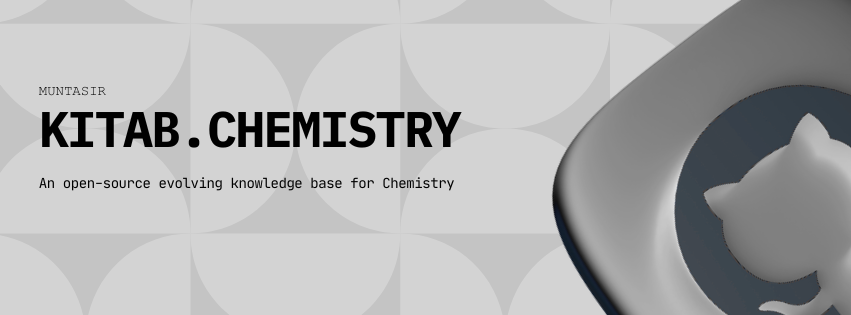

# Kitab.Chemistry

Welcome to **Kitab.Chemistry**, your companion in exploring the fundamental building blocks of matter.

---

## 📖 What is Kitab.Chemistry?

Kitab.Chemistry is a **community-powered library** designed to make chemistry accessible to everyone.  
We gather the best concepts, formulas, and insights from across the world of science into one simple, searchable place.

---

## 🌍 Our Vision

We believe that understanding the universe should be an **open door for everyone**.  
Whether you are just starting your journey into general chemistry or looking for deep dives into organic synthesis, Kitab.Chemistry is here to help you grow and share your knowledge with fellow explorers around the world.

---

🔗 Visit [Kitab.Chemistry](https://chemistry.muntasir.site)

